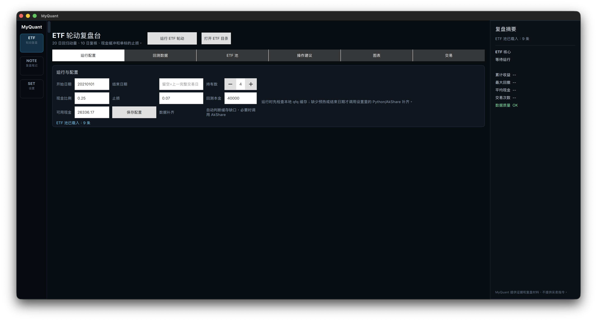
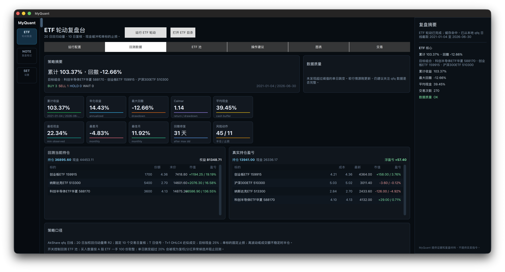
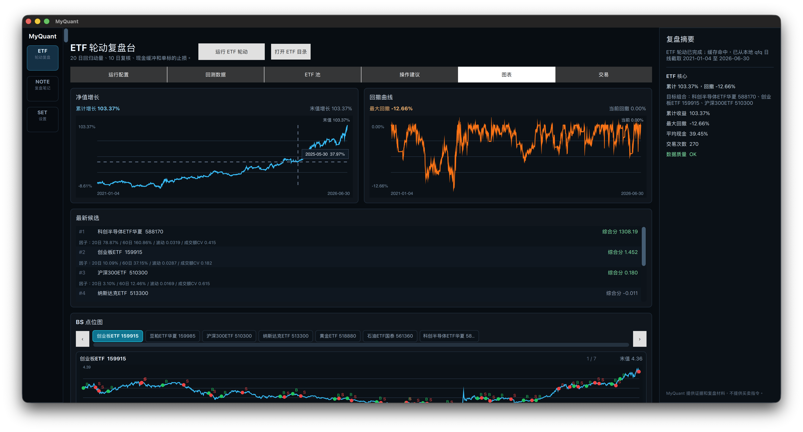

# MyQuant

MyQuant is a personal desktop research and review tool for ETF rotation, trading notes, and local settings.

This repository is an independent implementation. It does not copy source code, assets, brands, wording, or UI layouts from other products.

## Features

- ETF rotation review desk with AkShare/Python data refresh, local qfq cache, backtest metrics, trade details, and next-step review suggestions.
- Review notes with local SQLite storage and Markdown export.
- Local settings for data paths, Python/AkShare configuration, theme, backup/export, and cache cleanup.

## Screenshots

### ETF Run Configuration

Persisted run parameters, local qfq cache checks, and AkShare refresh controls.



### Backtest Data And Holdings

Backtest metrics, data quality checks, simulated current holdings, and real holding P/L review.



### Interactive Charts

Net value, drawdown, factor candidates, and per-symbol buy/sell point charts with hover details and time-axis zoom.



## Build

```bash
cmake --preset macos-release -DCMAKE_PREFIX_PATH="/path/to/Qt/6.8.3/macos"
cmake --build --preset macos-release
```

The macOS bundle is written to:

```text
build/macos-release/MyQuant.app
```

For a clean launchable copy:

```bash
tools/package_macos.sh
open ~/Applications/MyQuant.app
```

## Data

Runtime data is stored under:

```text
~/Library/Application Support/MyQuant
```

Subdirectories include `data`, `logs`, `cache`, `etf`, and `exports`.

## License

Copyright 2026 qirunzeng. All rights reserved.

This source package is published for personal, educational, and research use only. Commercial use is not permitted. See [LICENSE](LICENSE).

Third-party dependencies keep their own licenses and notices. Qt is used through the local Qt installation. Python, AkShare, pandas, and requests are optional runtime dependencies for live data fetching.

## Disclaimer

MyQuant provides research evidence and review material only. It does not provide financial advice or buy/sell instructions.
